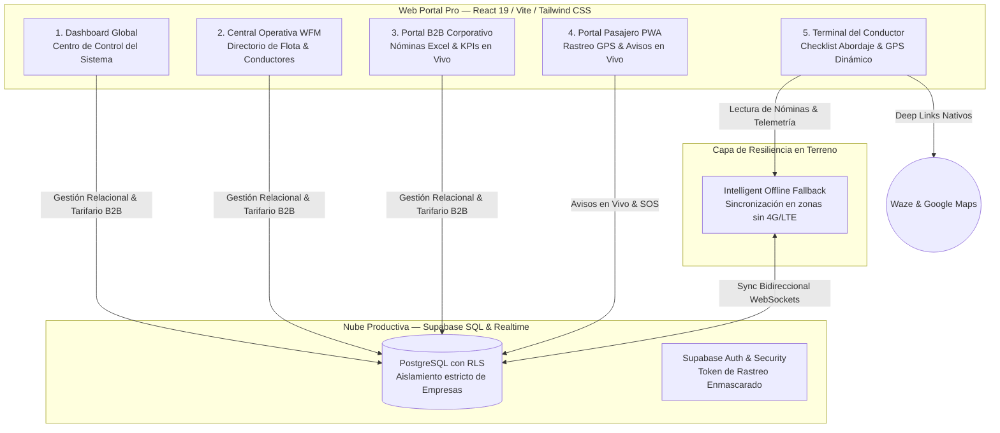

# Transportes Duet — Plataforma WFM & Gestión de Flota para Transporte Corporativo B2B

> **Arquitectura Enterprise Tier-1 de Gestión Operativa (Workforce Management & Telemetría en Ruta).**  
> Diseñada para empresas transportistas, clientes industriales y flotas del Gran Concepción, Región del Biobío y todo Chile.  
> *Creado con ❤️ por Duet Solutions.*

---

## 🏛️ Arquitectura y Visión General

**Transportes Duet** es un ecosistema SaaS corporativa diseñado con principios de **Workforce Management (WFM)** para la gestión integral de flotas de buses, vans y servicios de transporte de personal B2B (clínicas, plantas forestales, minería y puertos). 

La plataforma integra cinco superficies operativas interconectadas que eliminan la fricción en terreno, aseguran el cumplimiento de niveles de servicio (SLA) con clientes corporativos y automatizan la liquidación y cobros tarifarios en pesos chilenos (CLP$).



---

## 🚀 Los 5 Módulos Operativos del Ecosistema

| Módulo | Nombre del Portal | Destinatario / Usuario | Características Clave y WFM |
| :---: | :--- | :--- | :--- |
| **1** | **Dashboard Global** (*SaaS Master Control*) | Administrador del Sistema / Duet Solutions | Gestión centralizada de empresas transportistas, configuración de logotipos, paleta de colores corporativos en tiempo real y salud del sistema y servidores. |
| **2** | **Central Operativa WFM** (*Torre de Control*) | Gerente Operativo / Central de Tráfico 24/7 | Directorio operativo del Biobío (RUT, Licencias A1/A2/A3, puntaje de puntualidad), monitoreo de estados al volante (*● En Servicio* vs *● Fuera de Turno*) y asignación de rescates operacionales. |
| **3** | **Portal Clientes B2B** | Ejecutivos RRHH / Jefes de Planta de Empresas Contratantes | Monitoreo de SLA y costos acumulados del mes en CLP$. Administración de nómina de funcionarios con **Importador por Lotes Excel (.XLSX / .CSV)** y descarga de plantillas formatadas. |
| **4** | **Portal Pasajeros PWA** | Colaboradores / Funcionarios de Planta y Clínicas | Acceso directo sin descarga pesada de App. Visualización del conductor y patente de la Van, rastreo en ruta y **Buzón Operativo** de avisos en vivo (*"Bajo en 2 minutos"*). |
| **5** | **App Conductor Universal** (*Terminal en Ruta*) | Choferes y Conductores Profesionales | Interfaz ergonómica con **Paradero Dinámico** que salta al siguiente funcionario en espera, navegación en 1 clic hacia Waze/Google Maps y **Bloqueo de Validación WFM** (candado que impone marcar *"Abordo"* o *"Ausente"* en el 100% de los pasajeros antes de finalizar la ruta). |

---

## 🛠️ Stack Tecnológico & Seguridad

* **Core Frontend:** React 19 + TypeScript Estricto + Vite 8 (Compilación ultra-rápiada en `< 2s`).
* **Estilos & Ergonomía:** Vanilla CSS + Tailwind CSS v3 con soporte total y transiciones limpias entre **Modo Claro & Modo Oscuro (Dark Mode)** y tokens visuales institucionales.
* **Backend y Base de Datos (Fase 2):** Supabase (PostgreSQL 15+) con políticas **Row Level Security (RLS)** que blindan la privacidad entre diferentes transportistas.
* **Resiliencia Operativa:** Modelo Híbrido **Offline Fallback** con caché local que garantiza la continuidad del control de asistencia al volante incluso en zonas industriales o carreteras del sur de Chile con cobertura móvil intermitente.

---

## 📦 Instrucciones para Desarrollo Local y Puesta en Marcha

### 1. Requisitos Prerequisitos
* Node.js v18+ y NPM o Yarn installed.
* Cuenta activa y proyecto de [Supabase](https://supabase.com).
* Git instalado y autenticado con GitHub.

### 2. Configuración y Compilación Local (Web Portal)
```bash
# Clonar el repositorio
git clone https://github.com/abrahameister/Transportes-Duet.git
cd Transportes-Duet/web-portal

# Instalar dependencias empresariales
npm install

# Iniciar servidor de desarrollo en vivo (Puerto 5173 por defecto)
npm run dev

# Verificar compilación de producción en modo estricto
npm run build
```

### 3. Conexión con Supabase (SQL & Variables de Entorno)
1. Copia el archivo `.env.example` o configura en tu carpeta `web-portal/` el archivo `.env.local`:
   ```env
   VITE_SUPABASE_URL="https://vfhjwlnwuctuvqsxkmoz.supabase.co"
   VITE_SUPABASE_ANON_KEY="tu-anon-key-publica"
   ```
2. Accede al **SQL Editor** de tu Dashboard en Supabase y ejecuta en orden los scripts incluidos en el directorio `database/`:
   * `01_schema_wfm_pro.sql`: Creación de las 11 tablas relacionales del sistema y sus políticas RLS.
   * `02_seeding_biobio.sql`: Inyección masiva del catálogo de prueba del Gran Concepción (Empresas del Biobío, Choferes profesionales y Clientes Corporativos B2B como el Hospital Sanatorio Alemán y Planta Industrial ARAUCO).

---

## 📍 Datos Operativos del Gran Concepción (Seeder Dev)
El sistema incluye de serie un set de datos de prueba referenciados geográficamente y operacionalmente en la Región del Biobío, Chile:
* **Conductor Demo Activo:** Carlos Muñoz Valenzuela (RUT: `12.489.102-K`, Licencia A3, Van Mercedes-Benz Sprinter 516 CDI • Placa `VIP-100`).
* **Ruta en Curso Demo:** Ruta 160 ➔ Hospital Sanatorio Alemán & Huachipato.
* **Tarifario Corporative B2B:** Estructura de cobros estandarizada en Pesos Chilenos (CLP$) con control de kilometraje y tiempos de espera en paraderos.

---
*Transportes Duet • Creado con ❤️ por Duet Solutions.*  
*Arquitectura Enterprise Tier-1 de Fuerza Laboral y Movilidad B2B.*
